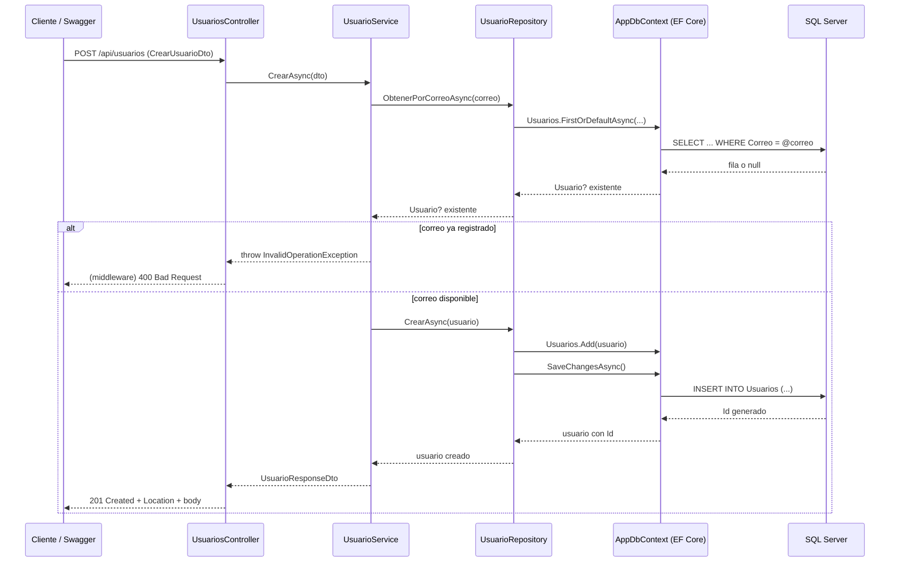

# Taller Práctico No. 3 — CRUD de Usuarios en .NET y SQL Server

Software Architecture · Ingeniería de Software · Uniempresarial

> **Nota sobre este repositorio**: el proyecto fue compilado, probado y ejecutado de extremo a extremo contra una
> instancia real de SQL Server (contenedor Docker) usando `dotnet build`, `dotnet test`, `dotnet ef migrations add`,
> `dotnet ef database update` y `dotnet run`, verificando los 5 endpoints desde Swagger. En el proceso se encontró
> y corrigió un bug real: los DTOs (`CrearUsuarioDto`/`ActualizarUsuarioDto`) tenían los atributos de validación
> con el target `[property: ...]`, lo cual hacía que ASP.NET Core 8 lanzara una excepción en tiempo de ejecución
> en **todo** `POST`/`PUT` ("*Record type ... has validation metadata defined on property ... that will be
> ignored*"), algo que `dotnet build` no detecta porque es un problema de metadatos en tiempo de ejecución, no de
> compilación. Se corrigió moviendo los atributos al parámetro del constructor posicional (sin el prefijo
> `property:`), que es donde ASP.NET Core 8 los espera en records con constructor primario.

## 1. Estructura del proyecto

```
Taller3-UsuarioApi/
├── UsuarioApi/                     # API principal (.NET 8 Web API)
│   ├── Controllers/UsuariosController.cs
│   ├── Data/AppDbContext.cs
│   ├── DTOs/UsuarioDtos.cs
│   ├── Entities/Usuario.cs
│   ├── Interfaces/IUsuarioRepository.cs
│   ├── Interfaces/IUsuarioService.cs
│   ├── Migrations/                 # Migración EF Core (InitialCreate), generada y aplicada
│   ├── Repositories/UsuarioRepository.cs
│   ├── Services/UsuarioService.cs
│   ├── Middleware/ExceptionHandlingMiddleware.cs
│   ├── Program.cs
│   ├── appsettings.json
│   └── UsuarioApi.csproj
├── UsuarioApi.Tests/                # Pruebas unitarias (xUnit + Moq)
│   ├── UsuarioServiceTests.cs
│   └── UsuarioApi.Tests.csproj
├── scripts/001_CrearBaseDeDatos.sql # Alternativa manual a las migraciones de EF Core
└── README.md
```

La arquitectura respeta el flujo exigido por el taller:

```
Cliente / Swagger
      ↓
UsuariosController        (HTTP: recibe la petición, mapea a IActionResult)
      ↓
IUsuarioService / UsuarioService   (casos de uso: reglas de negocio, p. ej. correo único)
      ↓
IUsuarioRepository / UsuarioRepository  (persistencia: consultas EF Core)
      ↓
AppDbContext (Entity Framework Core)
      ↓
SQL Server
```

## 2. Cómo ejecutar el proyecto

> Para una guía más detallada con checklist y solución de errores comunes (Docker, `dotnet-ef`, SQL Server,
> Swagger, etc.), ver [`DESPLIEGUE.md`](DESPLIEGUE.md).

### Requisitos previos
- [.NET 8 SDK](https://dotnet.microsoft.com/download/dotnet/8.0)
- SQL Server (Developer/Express/LocalDB) o un contenedor Docker con `mcr.microsoft.com/mssql/server:2019-latest`
  (ver nota sobre la imagen 2022 en [`DESPLIEGUE.md`](DESPLIEGUE.md#errores-comunes-y-solución))
- (Opcional) SSMS o Azure Data Studio, Postman

### Pasos

```bash
cd UsuarioApi
dotnet restore

# Ajuste la cadena de conexión en appsettings.json si su SQL Server no es "localhost"

dotnet ef migrations add InitialCreate
dotnet ef database update
```

Si `dotnet ef` no está instalado, agréguelo una vez con `dotnet tool install --global dotnet-ef`.

Si no puede usar migraciones (por ejemplo, no tiene permisos para crear la base desde su usuario), ejecute
manualmente `scripts/001_CrearBaseDeDatos.sql` en SSMS/Azure Data Studio — crea la misma base y tabla que
generaría la migración.

Luego ejecute la API:

```bash
dotnet run
```

Abra `https://localhost:7080/swagger` (o la URL que imprima la consola) para probar los cinco endpoints desde
Swagger.

### Ejecutar las pruebas unitarias

```bash
cd UsuarioApi.Tests
dotnet test
```

## 3. Endpoints

| Método | Endpoint                                                   | Acción              | Respuesta esperada |
|--------|-------------------------------------------------------------|---------------------|---------------------|
| GET    | `/api/usuarios?busqueda=&pagina=1&tamanoPagina=10`           | Listar usuarios (con búsqueda y paginación) | 200 OK |
| GET    | `/api/usuarios/{id}`                                         | Consultar por Id    | 200 OK / 404 |
| POST   | `/api/usuarios`                                              | Crear usuario       | 201 Created / 400 |
| PUT    | `/api/usuarios/{id}`                                         | Actualizar usuario  | 204 / 404 / 400 |
| DELETE | `/api/usuarios/{id}`                                         | Eliminar usuario    | 204 / 404 |

### Datos de prueba

```json
POST /api/usuarios
{
  "nombre": "Laura Gómez",
  "correo": "laura.gomez@correo.com",
  "telefono": "3001234567"
}
```

```json
PUT /api/usuarios/1
{
  "nombre": "Laura Gómez Pérez",
  "correo": "laura.gomez@correo.com",
  "telefono": "3119876543",
  "activo": true
}
```

## 4. Reto adicional implementado

Se implementaron **tres** de las mejoras sugeridas (el taller pedía al menos dos):

1. **Validación formal de campos obligatorios y correo** — `DTOs/UsuarioDtos.cs` usa `[Required]`,
   `[MinLength(3)]`, `[EmailAddress]` y `[Phone]`. Como el Controller tiene `[ApiController]`, ASP.NET Core valida
   el `ModelState` automáticamente y responde `400 Bad Request` sin código adicional en el Controller.
2. **Búsqueda por nombre/correo + paginación** en `GET /api/usuarios` (`busqueda`, `pagina`, `tamanoPagina`),
   implementada en `UsuarioRepository.ObtenerTodosAsync` (filtro `Where` + `Skip/Take`) y expuesta a través de
   `PaginacionResponseDto<T>`.
3. **Manejo global de excepciones mediante middleware** — `Middleware/ExceptionHandlingMiddleware.cs` centraliza
   la traducción de `InvalidOperationException` (regla de negocio) a `400` y de cualquier otra excepción a `500`,
   por lo que el Controller ya no necesita `try/catch`.

No se implementó "eliminación lógica" porque el taller exige explícitamente `DELETE` con `204/404` como parte del
CRUD obligatorio (sección 17); reemplazar el borrado físico por uno lógico habría contradicho ese requisito.

## 5. Preguntas de análisis

**1. ¿Por qué `UsuariosController` no debería consultar directamente `AppDbContext`?**
Porque mezclaría el protocolo HTTP con el acceso a datos, violando la separación de responsabilidades. El
Controller quedaría acoplado a Entity Framework Core y a SQL Server, sería imposible probarlo sin una base de
datos real, y cualquier regla de negocio (como el correo único) terminaría dispersa entre el Controller y la
persistencia en lugar de vivir en un solo lugar (el Service).

**2. ¿Qué principio SOLID se evidencia al depender de `IUsuarioRepository` en lugar de `UsuarioRepository`?**
El **Dependency Inversion Principle (DIP)**: los módulos de alto nivel (`UsuarioService`) no dependen de módulos
concretos de bajo nivel (`UsuarioRepository`), sino de una abstracción (`IUsuarioRepository`). Esto también
habilita el **Open/Closed Principle**, porque se puede sustituir la implementación (por ejemplo, por un
repositorio en memoria para pruebas) sin modificar el Service.

**3. ¿Qué ventaja ofrece usar DTOs en lugar de devolver la entidad `Usuario`?**
Desacopla el contrato público de la API del modelo de persistencia: se puede ocultar información interna (por
ejemplo, no se expone `FechaCreacion` salvo que se decida), se evita el *over-posting* (el cliente no puede
enviar `Id` o manipular campos que no le corresponden al crear), y el modelo de EF Core puede evolucionar sin
romper a los consumidores de la API.

**4. ¿En qué componente ubicó la regla de correo único y por qué?**
En `UsuarioService.CrearAsync`/`ActualizarAsync`. Es una regla de negocio (un caso de uso), no un detalle de
infraestructura: el Repository solo sabe *cómo* consultar datos (`ObtenerPorCorreoAsync`), pero decidir que un
correo duplicado es un error le corresponde a la capa de aplicación.

**5. ¿Qué tendría que cambiar si mañana SQL Server se reemplaza por otra tecnología?**
Solo la capa de infraestructura: el paquete de EF Core (`Microsoft.EntityFrameworkCore.SqlServer` por, por
ejemplo, `Npgsql.EntityFrameworkCore.PostgreSQL`), la configuración de `AddDbContext` en `Program.cs` y la cadena
de conexión. `UsuariosController`, `UsuarioService` y las interfaces no cambiarían, porque dependen de
abstracciones y no conocen el motor de base de datos.

**6. ¿Qué código HTTP retorna cada endpoint y por qué?**
- `GET /api/usuarios` → `200 OK` (siempre, incluso con lista vacía).
- `GET /api/usuarios/{id}` → `200 OK` si existe, `404 Not Found` si no.
- `POST /api/usuarios` → `201 Created` (con `Location` al recurso) si es válido; `400 Bad Request` si falla la
  validación del DTO o la regla de correo único.
- `PUT /api/usuarios/{id}` → `204 No Content` si actualiza, `404 Not Found` si no existe, `400 Bad Request` si el
  correo ya pertenece a otro usuario.
- `DELETE /api/usuarios/{id}` → `204 No Content` si elimina, `404 Not Found` si no existe.

**7. ¿Dónde agregaría una validación para impedir nombres vacíos?**
En el DTO de entrada, con `[Required]`/`[MinLength]` sobre la propiedad `Nombre` (ver `DTOs/UsuarioDtos.cs`).
Como el Controller tiene `[ApiController]`, ASP.NET Core valida el `ModelState` automáticamente antes de llamar
al Service, devolviendo `400` sin necesidad de código adicional. Validaciones que dependen de reglas de negocio
más complejas (por ejemplo, cruzar datos con otra entidad) irían en el Service.

**8. ¿Cómo probaría `UsuarioService` sin conectarse a SQL Server?**
Con pruebas unitarias que inyectan un doble de prueba (`Mock<IUsuarioRepository>` con Moq) en lugar de
`UsuarioRepository`, exactamente como se hace en `UsuarioApi.Tests/UsuarioServiceTests.cs`. Esto es posible
gracias a que `UsuarioService` depende de la interfaz `IUsuarioRepository`, no de `AppDbContext`.

**9. ¿Qué responsabilidad tiene `AppDbContext`?**
Representar la sesión (unidad de trabajo) contra la base de datos: mapea las entidades a tablas mediante
`DbSet<Usuario>`, rastrea los cambios de las entidades cargadas y traduce las consultas LINQ a SQL a través de
Entity Framework Core, además de coordinar `SaveChangesAsync` como una transacción.

**10. Recorrido completo de una petición POST desde Swagger hasta SQL Server y de regreso.**



## 6. Entregables de esta carpeta

- Proyecto .NET funcional (código fuente completo en `UsuarioApi/`).
- Script SQL equivalente a la migración (`scripts/001_CrearBaseDeDatos.sql`).
- Diagrama de arquitectura y de la petición POST (sección 5, pregunta 10).
- Este README con instrucciones de ejecución.
- Respuestas a las 10 preguntas de análisis (sección 5).
- Migraciones de EF Core generadas y verificadas (`UsuarioApi/Migrations/`), aplicadas exitosamente contra SQL
  Server (`dotnet ef database update`).
- Las cinco operaciones CRUD fueron probadas y verificadas contra una instancia real de SQL Server, tanto por
  Swagger como por línea de comandos (`curl`), incluyendo los casos de error (correo duplicado, validación de
  campos, 404 en recursos inexistentes).
- Capturas de Swagger del flujo CRUD completo en `capturas/` (lista vacía inicial, creación, consulta por id,
  actualización, eliminación y verificación del 404 posterior).
